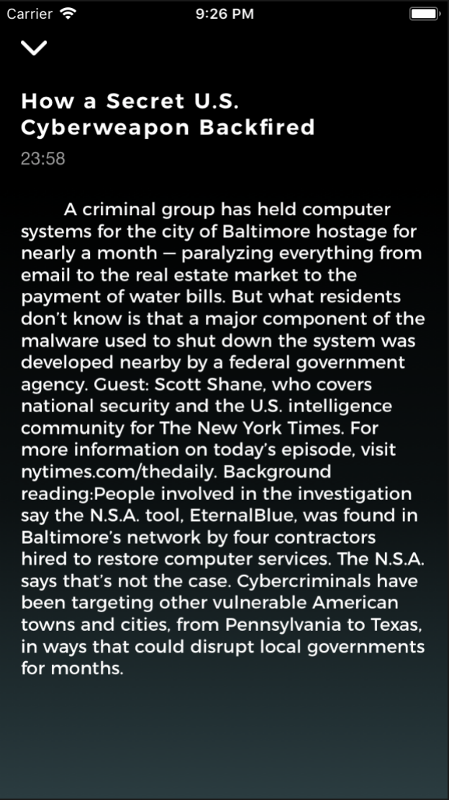

# CastAway Podcast Application
This was the project I built during my internship at Tonic Design Co. in 2017. 
It was the first coding project I created. It is a simple podcast application
that pulls data from selected podcasts on the internet and allows the user
to play episodes and view podcast information. I used React Native to build
the app. Below are some screenshots. 

